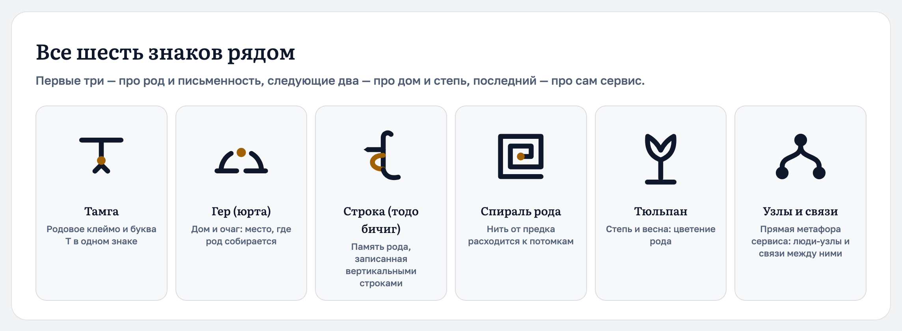

# Torlmud — логотип

Шесть знаков для сайта `torlmud.ru`, нарисованных на одной сетке и в одном визуальном
языке с текущим интерфейсом. Рядом — надпись в кривых, знак для вкладки браузера,
иконки приложения и OG-картинка.

**Выбран «Спираль рода»** — см. ниже, он уже стоит на сайте.

Открыть глазами: **`brand/torlmud/index.html`** (страница со всеми вариантами в контексте).
Коротко всё вместе — `png/preview-all-marks.png`.



## Что выбрано: «Спираль рода»

Непрерывная линия разворачивается от точки-предка в середине к виткам-потомкам:
нить рода, у которой нет ни начала, ни конца. Латунная точка в центре — общий предок,
от которого расходятся ветви.

- Знак говорит о родословной не метафорой дерева (таких логотипов тысячи), а линией
  времени: каждый виток — следующее поколение.
- Он масштабируется лучше остальных: в 16 px остаётся собой, потому что весь рисунок
  состоит из одной линии и одной точки.
- Рисуется в один цвет, поэтому живёт в любой теме без отдельной версии.

Для мелких размеров нарисована **вторая нарезка** — `svg/spiral-compact.svg`.
На 16–24 px полная спираль (шаг между витками 3.4) сливается в пятно, поэтому
у компактной витков меньше, шаг 6.0, а штрих толще. Компактная идёт в иконку вкладки,
иконки приложения и плашку в шапке; полная — в лок-ап, штамп и OG-картинку.

Сравнить обе нарезки в 16–128 px: карточка «Иконка вкладки» на `index.html`.

## Что уже стоит на сайте

| Что | Где |
|---|---|
| Знак в шапке (плашка 36×36, латунь) | `src/components/brand/TorlmudMark.tsx`, подключён в `src/app/page.tsx`, `src/app/(auth)/layout.tsx`, `src/app/invite/[token]/page.tsx` |
| Иконка вкладки, сама меняет цвет по схеме браузера | `src/app/icon.svg` |
| Иконка для iOS | `src/app/apple-icon.png` |
| Иконка приложения, OG-картинка | `export/icon-192.png`, `export/icon-512.png`, `export/og-dark.png` |

Компонент знака принимает `variant` (`compact` по умолчанию, `full` для крупных мест)
и `dotClassName` (`fill-current` — один цвет, `fill-brass-400` — двойной).
Геометрия в компоненте и в `svg/*.svg` одна и та же — при правке менять обе части.

Проверено на живом сайте: лендинг и `/login` отдают разметку со знаком,
`<link rel="icon" href="/icon.svg">` и `apple-icon.png` подхватываются.

## Остальные пять знаков

Они остаются в наборе — если захочется поменять: все лежат в `svg/`, карточки с
размерами и тёмной обложкой — на `index.html`.

| № | Знак | Идея | Живёт от |
|---|---|---|---|
| 1 | Тамга | Родовое клеймо + монограмма T | 16 px |
| 2 | Гер (юрта) | Дом и очаг, где род собирается | 16 px |
| 3 | Строка (тодо бичиг) | Память рода, записанная вертикальными строками | 32 px |
| 4 | **Спираль рода — выбран** | Нить от предка расходится к потомкам | 16 px (компактная) |
| 5 | Тюльпан | Степь и весна: цветение рода | 24 px |
| 6 | Узлы и связи | Люди-узлы и связи между ними | 16 px |

Каждый знак существует в четырёх видах:

- `<знак>.svg` — один цвет `currentColor`: годится и для светлой, и для тёмной темы;
- `<знак>-bold.svg` — утолщённый штрих для 16–24 px;
- `<знак>-color.svg` — чернила `#0f172a` + латунь `#a16207`;
- `lockup/<знак>-literata.svg`, `-golos.svg`, `-dark.svg` — знак с надписью.

## Что сознательно не взяли

Калмыцкая тема легко уводит в госсимволику и в сакральные образы. Отклонено:

| Мотив | Почему |
|---|---|
| Четыре скреплённых круга | Символ Дөрвөн Ойрад, но он стоит в гербе Калмыкии. Использование госсимволики в нарушение правил — административное правонарушение (ст. 19 КоАП РК; закон 44-I-З от 11.06.1996) |
| Хас (свастика) | Реальная форма тамги и буддийский благопожелательный знак, но в светском контексте читается как нацистская свастика |
| Лотос из девяти лепестков | Элемент флага Калмыкии; лотос вообще — священный цветок (бадм цецг) |
| Хадак, чётки, тханки, изображения будд | Культовые предметы: декором в товарном знаке быть не должны |
| Конкретная чужая тамга | Тамга — маркер конкретного рода, а не «общий калмыцкий» символ |

Палитра взята из `src/app/globals.css`, поэтому логотип не требует новых цветов:
чернила `#0f172a`, латунь `#a16207` (в тёмной теме `#f2f5fa` и `#d3ab35`).
Надпись — Literata: этот шрифт уже стоит в шапке и заголовках сайта.
Основной вариант надписи — **Torlmud** с заглавной, как домен `torlmud.ru` и как в коде
сайта; строчная `torlmud` оставлена запасной. В `lockup/` есть оба варианта, Golos Text
и вертикальный штамп с калмыцкой подписью «төрлмүд · родственники» для подвала и OG-картинки.

## Файлы

```
brand/torlmud/
├── index.html          страница со всеми вариантами (открыть в браузере)
├── svg/                знаки: <знак>.svg, -bold, -color, icon.svg, favicon.svg, tile-*.svg
│   └── lockup/         знак + надпись: Literata, Golos Text, тёмный вариант, штамп
├── export/             растры для сайта: favicon 16/32/48, icon 180/192/512, og-*.png
├── png/                снимки страницы превью (preview-*.png)
├── fonts/              Literata и Golos Text (Medium) в ttf — ими набирается надпись
└── tools/              build.mjs, export.mjs, shots.sh, crop.mjs
```

Пересобрать всё:

```bash
node brand/torlmud/tools/build.mjs     # svg + index.html
node brand/torlmud/tools/export.mjs    # растры в export/
bash brand/torlmud/tools/shots.sh      # снимки превью (нужен Chrome)
```

`build.mjs` переводит надпись из шрифта в кривые (opentype.js), поэтому итоговые SVG
открываются где угодно: без установленных шрифтов и без веб-запроса. Для пересборки
нужны `opentype.js` и `sharp` (`npm i --no-save opentype.js` — первый уже стоит в
`node_modules` после сборки этих файлов). Шрифты в `fonts/` — Literata и Golos Text
под лицензией SIL OFL, их можно держать в репозитории.

## Как встроить в другой место

Знак в шапке, иконка вкладки и иконка iOS уже стоят (см. выше). Если понадобится ещё:

1. Манифест приложения (PWA): `export/icon-192.png` и `export/icon-512.png`.
2. OG-картинка для соцсетей: `export/og-dark.png` (1200×630) — в
   `metadata.openGraph.images`, сейчас её в проекте нет.
3. Подвал или отдельная посадочная страница — вертикальный штамп:
   `svg/lockup/pick-stacked.svg` (светлый) и `pick-stacked-dark.svg`.
4. Другой размер знака в React — тот же компонент:

   ```tsx
   <TorlmudMark className="h-5 w-5" />                          {/* компактная нарезка */}
   <TorlmudMark className="h-8 w-8" variant="full" />           {/* полная, для крупных мест */}
   <TorlmudMark className="h-6 w-6 text-ink-800" dotClassName="fill-brass-500" />
   ```

## Открытые вопросы

1. **Написание — Torlmud.** Согласовано: бренд `Torlmud`, домен `torlmud.ru`, так же в
   `<title>`, в шапке и в макетах `ui-variants`. Калмыцкое слово, от которого имя пошло, —
   **төрлмүд** («родня»): оно стоит подписью в вертикальном штампе, а не в основной надписи.
   Если понадобится строчная надпись, в `tools/build.mjs` достаточно поменять местами
   `WORDS.title` и `WORDS.lower` и пересобрать.
2. **Знак — свой.** Спираль нарисована с нуля и не повторяет ни госсимволику, ни
   сакральные образы, ни чужую родовую тамгу. Если бренд закрепляется всерьёз,
   имеет смысл проверить его на совпадения по товарным знакам.
3. **«Строка» (тодо бичиг)**, оставшаяся в наборе, нарисована по описанию буквы «о»,
   но это мотив письма, а не каллиграфическая цитата: если вернётесь к ней — покажите
   носителю языка.

## Источники по культурной части

- төрлмүд = «родня»: [Русско-калмыцкий словарь](https://russian_kalmyk.academic.ru/8775/%D1%80%D0%BE%D0%B4%D0%BD%D1%8F)
- тодо бичиг, состав и формы букв: [Тодо-бичиг](https://ru.wikipedia.org/wiki/%D0%A2%D0%BE%D0%B4%D0%BE-%D0%B1%D0%B8%D1%87%D0%B8%D0%B3), [Clear Script](https://en.wikipedia.org/wiki/Clear_Script), [Category:Todo bichig letters](https://commons.wikimedia.org/wiki/Category:Todo_bichig_letters)
- тамги ойратов и их формы: [Бембеев, Есенова, Дулам, 2021](https://cyberleninka.ru/article/n/k-voprosu-o-tamgovoy-kulture-oyratov-zapadnoy-mongolii), [Гедеева, о калмыцких родовых тамгах](http://kigiran.com/pubs/index.php/history/article/view/1689/0)
- четыре скреплённых круга и госсимволика: [Герб Калмыкии](https://ru.wikipedia.org/wiki/%D0%93%D0%B5%D1%80%D0%B1_%D0%9A%D0%B0%D0%BB%D0%BC%D1%8B%D0%BA%D0%B8%D0%B8), [Флаг Калмыкии](https://ru.wikipedia.org/wiki/%D0%A4%D0%BB%D0%B0%D0%B3_%D0%9A%D0%B0%D0%BB%D0%BC%D1%8B%D0%BA%D0%B8%D0%B8), [закон 44-I-З](https://base.garant.ru/24914938/), [ст. 19 КоАП РК](https://base.garant.ru/24907473/a573badcfa856325a7f6c5597efaaedf/)
- орнамент «зег» и мотивы: [Батырева, 2021](https://cyberleninka.ru/article/n/narodnoe-dekorativno-prikladnoe-iskusstvo-oyratov-mongolii-k-postanovke-problemy-izucheniya), [о меандре «зег»](https://cyberleninka.ru/article/n/meandr-zeg-v-dekore-voyloka-kak-otobrazhenie-mirovideniya-kalmykov-i-oyratov-mongolii)
- юрта: части и названия (гер, харач, уньн, үүдн) — [Житецкий, ч. 1](https://baylig.ru/nasledie/kibitka-ee-chasti-i-ustrojstvo/), [ч. 2](https://baylig.ru/nasledie/kibitka-ee-chasti-i-ustrojstvo-chast-2-koshemnyj-pokrov/)
- тюльпан как символ степи: [НИТ](https://nit.tuva.asia/nit/ru/issue/download/67/92)
